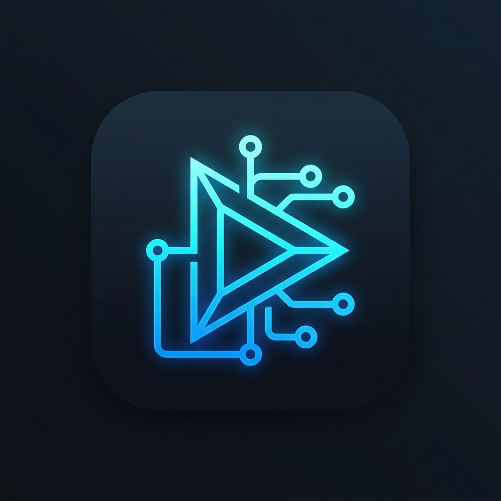

<p align="center">
  
</p>

<h1 align="center">Runly — Visual Developer Workflow Automation for VS Code</h1>

<p align="center">
  <strong>Build your workflow. Run it instantly.</strong><br>
  <em>Turn repetitive development tasks into one click.</em>
</p>

<p align="center">
  <a href="#-overview">Overview</a> •
  <a href="#-key-features">Features</a> •
  <a href="#-supported-ecosystems--languages">Languages</a> •
  <a href="#-installation-guide">Installation</a> •
  <a href="#-how-to-open--use-runly">Usage Guide</a> •
  <a href="#-activity-bar--sidebar-integration">Sidebar</a> •
  <a href="#-built-in-action-nodes-reference">Node Reference</a> •
  <a href="#-security--safety-model">Security</a> •
  <a href="#-support">Support</a>
</p>

---

## 🚀 Overview

**Runly** is a **local-first visual workflow automation extension for VS Code**. It empowers developers to automate repetitive development tasks by visually connecting action nodes on an interactive node graph canvas.

Instead of manually repeating terminal commands, waiting for servers to boot, manually launching browsers, running unit tests, and executing builds:

```text
Open terminal ➔ npm install ➔ npm run dev ➔ Wait 3s ➔ Open browser ➔ Run tests ➔ Build
```

You create a Runly workflow **once**:

```text
[START] ➔ [npm install] ➔ [npm run dev] ➔ [Wait 3s] ➔ [Open Browser] ➔ [Notification]
```

And trigger it instantly with **one click from the Activity Bar Sidebar**, a **keyboard shortcut**, the **Command Palette**, or the **Dashboard**.

---

## ✨ Key Features

- 🎨 **Visual Builder Canvas**: Interactive drag-and-drop React Flow canvas with custom nodes, handles, zoom/pan controls, and auto-layout.
- ⚡ **Local-First & 100% Offline**: Zero external servers, backend-free, account-free, and API-key-free.
- 📁 **Git-Friendly Workflows**: Workflows are saved directly to `.runly/workflows/*.runly.json` in your workspace for easy repository commits and team sharing.
- 🗂️ **Activity Bar & Sidebar Tree View**: Access, run, edit, duplicate, and delete workflows directly from the native VS Code Activity Bar sidebar panel.
- 🔍 **Smart Project Detection**: Automatically scans your project root (`package.json`, `Cargo.toml`, `requirements.txt`, `Dockerfile`, `go.mod`, etc.) and recommends preset templates.
- 🔀 **Branching Logic & Conditions**: Branch your workflow DAG based on exit codes, file/folder existence, previous step success/failure, OS, or environment variables.
- 📝 **Built-in Variables & Parameters**: Dynamically resolve `${workspaceFolder}`, `${file}`, `${fileName}`, `${os}`, `${env.PORT}`, and prompt user input parameters before run.
- 🖥️ **Live Terminal Log Monitor**: Track step progress in real time with live badges (`RUNNING`, `SUCCESS`, `FAILED`) and streaming stdout/stderr process output logs.
- 🛡️ **Security Trust Model**: Security Review Modal warns users before running imported untrusted workflows containing executable shell commands.
- 📑 **JSON Schema Support**: Included `schemas/workflow.schema.json` provides schema validation and autocomplete for all `*.runly.json` files.

---

## 🌐 Supported Ecosystems & Languages

Runly is framework-independent and supports any language or toolchain:

| Ecosystem / Stack | Detected Files | Included Presets |
| :--- | :--- | :--- |
| **React** | `package.json` (`react`) | React Dev, React Test, React Build |
| **Vite** | `package.json` (`vite`) | Vite Dev, Vite Build, Vite Preview |
| **Next.js** | `package.json` (`next`) | Next Dev, Next Build, Next Start |
| **Node.js** | `package.json` | Node Install, Node Test, Node Build |
| **Python** | `requirements.txt`, `pyproject.toml` | Python Run, Python Test, Virtualenv |
| **Docker** | `Dockerfile`, `docker-compose.yml` | Docker Compose Up, Build, Down |
| **Rust** | `Cargo.toml` | Cargo Run, Cargo Test, Cargo Build |
| **Go** | `go.mod` | Go Run, Go Test, Go Build |
| **Java** | `pom.xml`, `build.gradle` | Maven / Gradle Build & Test |
| **Flutter / Dart** | `pubspec.yaml` | Flutter Run, Flutter Build |
| **Generic / C / C++** | Makefiles, CMakeLists.txt | Custom Shell Commands & Scripts |

---

## 🛠️ Installation Guide

### Option 1: Install from VS Code Marketplace (Standard)

1. Open VS Code and open the **Extensions** sidebar (`Ctrl+Shift+X` / `Cmd+Shift+X`).
2. Search for **`Runly`**.
3. Click **Install**.

Alternatively, install via terminal:
```bash
code --install-extension JeswinJohn.runly
```

---

### Option 2: Install Offline via VSIX Package

If installing manually without internet access or from a local package build:

1. Open VS Code Extensions sidebar (`Ctrl+Shift+X` / `Cmd+Shift+X`).
2. Click the **`...` (More Actions)** menu icon in the top-right corner.
3. Select **Install from VSIX...**
4. Select `runly-0.1.0.vsix`.

Alternatively, via terminal:
```bash
code --install-extension runly-0.1.0.vsix
```

---

## 📖 How to Open & Use Runly

### 1. How to Open Runly
You can open Runly in any of the following ways:
- **Activity Bar Icon (Primary)**: Click the **Runly $(play-circle)** icon on the left VS Code Activity Bar to open the Runly Workflows Sidebar.
- **Keyboard Shortcut**: Press **`Ctrl+Alt+R`** (or `Cmd+Alt+R` on macOS) to open the full Visual Dashboard & Builder.
- **Status Bar Item**: Click **`$(play-circle) Runly`** at the bottom-left of your VS Code window.
- **Command Palette**: Press **`Ctrl+Shift+P`** / `Cmd+Shift+P`, type **`Runly`**, and select **`Runly: Open Dashboard & Builder`**.

---

### 2. How to Open & Edit an Existing Workflow
- **From the Sidebar**: Under **Workflows**, **Favorites**, or **Recent**, click on any workflow item (or click the edit pencil `✏️` icon). It immediately opens the workflow inside the visual builder canvas.
- **From the Dashboard**: Go to the **Workflows** or **Dashboard** tab, and click **`Edit`** on the workflow card.
- **From Command Palette**: Run **`Runly: Manage Workflows`** and select the workflow you want to open.

---

### 3. How to Create a New Workflow
- **From the Sidebar**: Click the **`+`** icon at the top of the Runly Sidebar panel, or click **`+ New Workflow`**.
- **From the Dashboard**: Click the **`+ New Workflow`** button in the header.
- **From Command Palette**: Run **`Runly: New Workflow`**, enter a workflow name, and start building.

---

### 4. How to Use Auto-Detected Presets & Templates
- When you open Runly in a workspace, it automatically detects your project stack (e.g. React, Vite, Next.js, Python, Rust, Go, Docker).
- A recommendation banner appears with matching templates:
  > **React Project Detected** — Recommended: `⚡ React Development` `[Use Template]`
- Click **`Use Template`** to instantly load and save the pre-configured workflow DAG.
- You can also browse and select any preset from the **Templates** section in the Sidebar or the **Templates** tab in the Dashboard.

---

### 5. How to Build & Connect Workflow Nodes
- **Add Nodes**: Click any action icon in the top-left floating toolbar (**Command**, **Terminal**, **File**, **URL**, **Task**, **Delay**, **Condition**, **Notification**, **Script**).
- **Connect Nodes**: Click and drag from the circular output handle at the bottom of one node to the input handle at the top of another node.
- **Configure Parameters**: Click any node on the canvas to open the **Properties Panel** on the right side. Customize shell commands, working directories, timeouts, environment variables, or error policies (`stop` vs `continue`).
- **Auto-Layout**: Click **`Auto Layout`** in the top toolbar to automatically organize your DAG neatly.
- **Save**: Click **`Save`**. Workflows are stored locally in your workspace under `.runly/workflows/<id>.runly.json`.

---

### 6. How to Run & Monitor Workflows
- **1-Click Run from Sidebar**: Hover over any workflow in the Runly Sidebar and click the **`▶` Run** button.
- **Run from Builder Canvas**: Click the green **`▶ Run Workflow`** button in the canvas header.
- **Run from Command Palette**: Press `Ctrl+Shift+P` and choose **`Runly: Run Workflow`**, then select the workflow to execute.
- **Execution Monitor**: Runly switches to the **Monitor** tab displaying live step badges (`QUEUED`, `RUNNING`, `SUCCESS`, `FAILED`) with elapsed time and real-time streaming terminal logs (`stdout` / `stderr`).
- **Stop Anytime**: Click **`■ Stop`** to immediately and safely terminate active child processes and cancel execution.

---

## 🗂️ Activity Bar & Sidebar Integration

The Runly Activity Bar Sidebar provides instant access directly in VS Code:
- **⭐ Favorites**: Quick access to starred workflows.
- **🕒 Recent Workflows**: Re-run recent workflows with one click.
- **📂 Workspace Workflows**: View all `.runly.json` workflows stored in your workspace.
- **⚡ Preset Templates**: One-click starter templates for React, Vite, Next.js, Node.js, Python, Rust, Go, and Docker.
- **Sidebar Actions**:
  - `▶ Run`: Execute workflow immediately.
  - `✏️ Open/Edit`: Open workflow in visual canvas editor.
  - `📑 Duplicate`: Clone workflow.
  - `🗑️ Delete`: Remove workflow from workspace.
  - `📤 Export`: Export as `.runly.json`.

---

## 📦 Built-in Action Nodes Reference

| Node Type | Icon | Description | Key Properties |
| :--- | :---: | :--- | :--- |
| **Start** | ▶ | Workflow entry point | None |
| **Command** | 💻 | Run background shell process | Command, Working Dir, Shell, Env Vars, On Error |
| **Terminal** | 🖥️ | Open & send command to VS Code terminal | Terminal Name, Command, Reuse Terminal |
| **File** | 📄 | Open, reveal, create, or save files | Action, Path, File Content |
| **URL** | 🌐 | Open browser link | Browser URL (`http://localhost:${PORT}`) |
| **Task** | ☑️ | Execute VS Code workspace task | Task Name |
| **VS Code Cmd** | 🛠️ | Run internal VS Code API command | Command ID (`workbench.action.files.saveAll`) |
| **Delay** | ⏱️ | Pause workflow execution | Duration (ms) |
| **Notification** | 🔔 | Show VS Code toast message | Type (info/success/warning/error), Message |
| **Condition** | 🔀 | Branch DAG on logic evaluation | Condition Type, Target Value / Exit Code |
| **Script** | 📝 | Execute custom JavaScript snippet | Code, Timeout |

---

## 🔤 Variables & User Parameters

### Built-in Variables
Variables are dynamically resolved at runtime in commands, paths, and URLs:
- `${workspaceFolder}`: Absolute path to the active workspace folder.
- `${workspaceName}`: Name of the current workspace.
- `${file}`: Currently active editor file path.
- `${fileName}`: Active file basename (e.g. `App.tsx`).
- `${fileDir}`: Active file parent directory.
- `${os}` / `${platform}`: Operating system (`win32`, `darwin`, `linux`).
- `${home}`: User home directory.
- `${env.VAR_NAME}`: Environment variable (e.g. `${env.PORT}`).

### User Parameters
Workflows can request custom input values before execution (e.g. port, target environment). A parameter prompt dialog appears before running, and values are injected into `${PORT}`, `${ENVIRONMENT}`, etc.

---

## 🔒 Security & Safety Model

Because Runly executes commands locally on your computer:
1. **No External Network Requests**: Runly does not upload code, telemetry, or workflows to any external cloud server.
2. **Untrusted Command Review**: Imported `.runly.json` files containing shell commands trigger a **Security Warning Modal** before execution, allowing you to review all executable lines before trusting them.

---

## ⌨️ Command Palette Integration

Runly registers the following VS Code commands:

- `Runly: Open Dashboard & Builder`
- `Runly: New Workflow`
- `Runly: Run Workflow`
- `Runly: Stop Active Workflow`
- `Runly: Manage Workflows`
- `Runly: Import Workflow (.runly.json)`
- `Runly: Export Workflow`
- `Runly: Refresh Sidebar`
- `Runly: Settings`

---

## 🤝 Contributing

We welcome community contributions! Please read our [CONTRIBUTING.md](CONTRIBUTING.md) for details on code style, testing, and pull requests.

---

## 🛡️ Security

For vulnerability disclosures, please review our [SECURITY.md](SECURITY.md) policy or contact [support.runly@gmail.com](mailto:support.runly@gmail.com).

---

## 💬 Support

For questions, bug reports, or support requests:
- 📧 **Support Email**: [support.runly@gmail.com](mailto:support.runly@gmail.com)
- 🐛 **GitHub Issues**: [https://github.com/Jeswin-john10/runly/issues](https://github.com/Jeswin-john10/runly/issues)
- 🌐 **Official Repository**: [https://github.com/Jeswin-john10/runly](https://github.com/Jeswin-john10/runly)

---

## 📄 License

Distributed under the **MIT License**. See [LICENSE](LICENSE) for details.

---

<p align="center">
  Developed with ❤️ by <strong>Jeswin John</strong> — <em>Passionate Software Developer</em>
</p>
